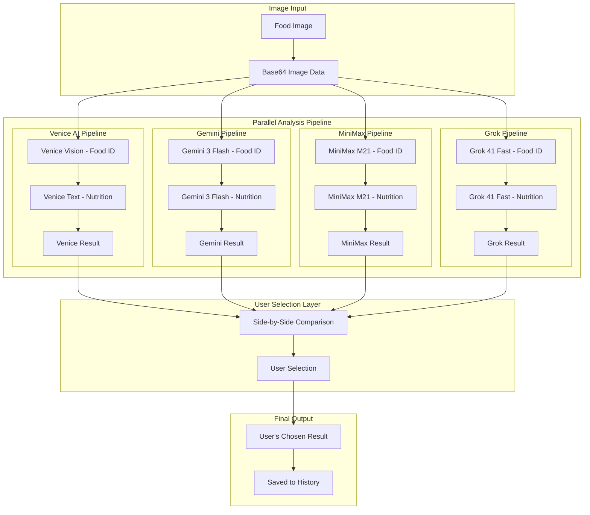

# Multi-Model Robust Image Nutrition Detection

## Executive Summary

This document outlines a plan to significantly improve the robustness and accuracy of the Food Calorie Counter's image nutrition detection by implementing a **multi-model parallel approach**. The system will leverage four different AI models to analyze food images and calculate nutrition, presenting **both results side-by-side** so the user can choose which analysis to save. This gives users full control over their nutrition data.

## User-Centric Design Principle

> **"Show both results and let the user decide which one to save"**

This is the core principle of the new architecture. Users will see analyses from multiple models simultaneously, compare the results, and make an informed decision about which nutrition breakdown best matches their meal.

## Current State Analysis

### What Works Well
- Two-stage analysis pipeline (vision → text model)
- Structured JSON output with schema validation
- French language support
- Comprehensive nutrition breakdown (macros, micros, items)
- Professional nutritionist persona prompts

### Areas for Improvement
- Single model dependency creates single point of failure
- Limited robustness - one model's error affects entire analysis
- No user choice in how their data is analyzed
- No side-by-side comparison of different analysis approaches
- Limited to Venice AI models only

## Proposed Multi-Model Architecture

### Model Selection & Roles



### Model Responsibilities & APIs

#### 1. **Venice AI** (Current Implementation - Keep as Option)
- **Role**: Legacy pipeline for backward compatibility
- **Models**: `mistral-31-24b` (vision) + `qwen3-235b` (text)
- **Use Case**: Users familiar with Venice results

#### 2. **Gemini 3 Flash Preview** (New Primary)
- **Role**: Fast, accurate food identification and nutrition analysis
- **API**: Google Gemini API (`generativelanguage.googleapis.com`)
- **Strengths**: Excellent vision, fast inference, structured JSON
- **Use Case**: Best all-around balance of speed and accuracy

#### 3. **MiniMax M21** (New Alternative)
- **Role**: Alternative perspective on food content
- **API**: MiniMax Vision API
- **Strengths**: Different training data, good for edge cases
- **Use Case**: Validation or alternative when Gemini differs

#### 4. **Grok 41 Fast** (New Rapid Option)
- **Role**: Quick analysis with xAI's Grok model
- **API**: xAI Grok API (`api.x.ai`)
- **Strengths**: Very fast, good reasoning capabilities
- **Use Case**: Fast confirmation or when speed matters

## Key User Flow

```mermaid
sequenceDiagram
    participant User
    participant App
    participant Models
    participant History

    User->>App: Upload food image
    App->>Models: Run ALL 4 models in parallel
    Models-->>App: Return 4 nutrition summaries
    
    App->>User: Display side-by-side comparison
    
    rect rgb(240, 240, 255)
        Note over User: User compares:
        - Total calories
        - Macro breakdown
        - Item identification
        - Confidence scores
    end
    
    User->>App: Select preferred result
    
    App->>History: Save chosen result
    App->>User: Show saved confirmation
```

## Implementation Details

### 1. New API Integration Layer

#### File: `app/lib/multi-model-api.ts`

```typescript
// Base configuration for all models
interface ModelConfig {
  name: string;
  displayName: string;
  endpoint: string;
  apiKeyEnv: string;
  timeout: number;
  temperature: number;
}

// Specific model configurations
const GEMINI_FLASH_CONFIG: ModelConfig = {
  name: "gemini-3-flash",
  displayName: "Gemini 3 Flash",
  endpoint: "https://generativelanguage.googleapis.com/v1beta/models/gemini-1.5-flash:generateContent",
  apiKeyEnv: "GEMINI_API_KEY",
  timeout: 30000,
  temperature: 0.3,
};

const MINIMAX_M21_CONFIG: ModelConfig = {
  name: "minimax-m21",
  displayName: "MiniMax M21",
  endpoint: "https://api.minimax.chat/v1/text/chatcompletion_v2",
  apiKeyEnv: "MINIMAX_API_KEY",
  timeout: 25000,
  temperature: 0.4,
};

const GROK_41_CONFIG: ModelConfig = {
  name: "grok-41-fast",
  displayName: "Grok 41 Fast",
  endpoint: "https://api.x.ai/v1/chat/completions",
  apiKeyEnv: "GROK_API_KEY",
  timeout: 20000,
  temperature: 0.5,
};

// Unified API call function
async function callModelAPI(
  config: ModelConfig,
  imageBase64: string,
  prompt: string
): Promise<any> {
  const apiKey = process.env[config.apiKeyEnv];
  if (!apiKey) {
    throw new Error(`${config.name} API key not configured`);
  }

  const response = await fetch(`${config.endpoint}?key=${apiKey}`, {
    method: "POST",
    headers: {
      "Content-Type": "application/json",
    },
    body: JSON.stringify({
      contents: [{
        parts: [
          { text: prompt },
          { inline_data: { mime_type: "image/jpeg", data: imageBase64 } }
        ]
      }],
      generationConfig: {
        temperature: config.temperature,
        responseMimeType: "application/json",
      }
    }),
  });

  if (!response.ok) {
    throw new Error(`${config.name} API error: ${response.statusText}`);
  }

  return response.json();
}
```

### 2. Food Identification Functions

#### File: `app/lib/food-identification.ts`

```typescript
// Gemini 3 Flash Preview - Primary Food ID
async function identifyWithGemini(imageBase64: string): Promise<FoodIdentification> {
  const prompt = `You are an expert food identification AI. Analyze this food image and provide:
  1. List of all visible food items with specific names
  2. Estimated quantities (number of pieces, serving size)
  3. Preparation methods visible (fried, baked, raw, etc.)
  4. Approximate portion sizes in grams
  5. Confidence score for each identification

Return as JSON matching this schema:
{
  "items": [{
    "name": string,
    "quantity": number,
    "unit": string,
    "estimatedGrams": number,
    "preparation": string,
    "confidence": number
  }],
  "overallConfidence": number,
  "visualObservations": string[]
}`;

  return await callModelAPI(GEMINI_FLASH_CONFIG, imageBase64, prompt);
}

// MiniMax M21 - Validation Food ID
async function identifyWithMiniMax(imageBase64: string): Promise<FoodIdentification> {
  const prompt = `Analyze this food image from a different perspective:
  1. What are the main food components?
  2. Estimate the total meal composition
  3. Note any ingredients that might be missed in primary analysis
  4. Provide alternative portion estimates

Return as JSON matching this schema:
{
  "items": [...],
  "alternativeObservations": string[],
  "complementaryItems": string[]
}`;
}
```

### 3. Nutrition Analysis Functions

#### File: `app/lib/nutrition-analysis.ts`

```typescript
// Gemini 3 Flash Preview with Reasoning - Primary Nutrition
async function analyzeNutritionWithGemini(foodData: FoodIdentification): Promise<NutritionResult> {
  const prompt = `As a certified clinical nutritionist with 20+ years of experience, calculate nutrition for:

${JSON.stringify(foodData.items, null, 2)}

Provide detailed calculations:
1. Macronutrient breakdown (protein, carbs, fat with subtypes)
2. Micronutrient estimates (sodium, potassium, calcium, iron, vitamins)
3. Calorie calculations with methodology
4. Per-item calorie breakdown
5. Health considerations and cautions

Use reasoning trace to show calculation steps.`;

  return await callModelAPI(GEMINI_FLASH_CONFIG, JSON.stringify(foodData), prompt);
}

// Grok 41 Fast - Quick Nutrition Validation
async function validateNutritionWithGrok(foodData: FoodIdentification): Promise<NutritionResult> {
  const prompt = `Quickly validate nutritional estimates for:
  ${JSON.stringify(foodData.items, null, 2)}

Provide:
1. Total calorie estimate
2. Key macronutrient ratios
3. Any concerns or unusual values
4. Confidence assessment`;

  return await callModelAPI(GROK_41_CONFIG, JSON.stringify(foodData), prompt);
}
```

### 4. Unified Result Type

#### File: `app/lib/venice.ts` - Add new types

```typescript
// Multi-model result container
export type MultiModelResult = {
  modelName: string;
  displayName: string;
  nutritionSummary: NutritionSummary;
  analysisTime: number;
  confidence: number;
};

// Result selection state
export type SelectedResult = {
  modelName: string;
  savedAt: Date;
  nutritionSummary: NutritionSummary;
};
```

### 5. UI Updates for User Selection

#### File: `src/App.tsx` - Add comparison UI

```typescript
// Add state for multiple results
const [allResults, setAllResults] = useState<MultiModelResult[]>([]);
const [selectedModel, setSelectedModel] = useState<string | null>(null);

// Parallel analysis function
async function runAllModels(imageBase64: string): Promise<MultiModelResult[]> {
  const results = await Promise.allSettled([
    analyzeWithVenice(imageBase64),
    analyzeWithGemini(imageBase64),
    analyzeWithMiniMax(imageBase64),
    analyzeWithGrok(imageBase64),
  ]);

  return results
    .filter((r): r is PromiseFulfilledResult<MultiModelResult> => 
      r.status === "fulfilled"
    )
    .map(r => r.value);
}

// Display side-by-side comparison
{allResults.length > 0 && (
  <ModelComparisonPanel
    results={allResults}
    selectedModel={selectedModel}
    onSelectModel={setSelectedModel}
    onSave={(result) => {
      setSelectedModel(result.modelName);
      setResult(result.nutritionSummary);
    }}
  />
)}
```

#### New Component: `app/components/ModelComparisonPanel.tsx`

```typescript
export function ModelComparisonPanel({ 
  results, 
  selectedModel, 
  onSelectModel, 
  onSave 
}: ModelComparisonPanelProps) {
  return (
    <div style={{ background: "rgba(255,255,255,0.95)", borderRadius: 24, padding: 24 }}>
      <h2 style={{ margin: "0 0 20px", fontSize: 24, fontWeight: 700 }}>
        Compare Analysis Results
      </h2>
      
      <p style={{ color: "#64748b", marginBottom: 20 }}>
        Review the nutrition analysis from each model and select your preferred result to save.
      </p>

      <div style={{ display: "grid", gap: 16 }}>
        {results.map((result) => (
          <ModelResultCard
            key={result.modelName}
            result={result}
            isSelected={selectedModel === result.modelName}
            onSelect={() => onSelectModel(result.modelName)}
            onSave={() => onSave(result)}
          />
        ))}
      </div>

      <div style={{ 
        marginTop: 20, 
        padding: 16, 
        background: "rgba(99,102,241,0.1)", 
        borderRadius: 12 
      }}>
        <h4 style={{ margin: "0 0 8px" }}>💡 Comparison Tips</h4>
        <ul style={{ margin: 0, paddingLeft: 20, color: "#475569" }}>
          <li>Compare total calorie estimates between models</li>
          <li>Check if item identification matches your meal</li>
          <li>Consider the confidence score when deciding</li>
          <li>Review portion sizes that seem most accurate</li>
        </ul>
      </div>
    </div>
  );
}

function ModelResultCard({ result, isSelected, onSelect, onSave }: ModelResultCardProps) {
  return (
    <div style={{
      border: isSelected ? "2px solid #4f46e5" : "1px solid rgba(148,163,184,0.3)",
      borderRadius: 16,
      padding: 20,
      background: isSelected ? "rgba(99,102,241,0.05)" : "rgba(255,255,255,0.9)",
      cursor: "pointer",
      transition: "all 0.2s",
    }}>
      <div style={{ display: "flex", justifyContent: "space-between", alignItems: "flex-start" }}>
        <div>
          <h3 style={{ margin: 0, fontSize: 18, fontWeight: 600 }}>
            {result.displayName}
          </h3>
          <div style={{ color: "#64748b", fontSize: 13, marginTop: 4 }}>
            Analysis time: {result.analysisTime.toFixed(1)}s
          </div>
        </div>
        <div style={{ 
          padding: "6px 12px", 
          borderRadius: 999,
          background: result.confidence > 85 ? "rgba(16,185,129,0.15)" : "rgba(251,191,36,0.15)",
          color: result.confidence > 85 ? "#047857" : "#d97706",
          fontWeight: 600,
          fontSize: 13,
        }}>
          {result.confidence}% confidence
        </div>
      </div>

      <div style={{ display: "grid", gridTemplateColumns: "repeat(4, 1fr)", gap: 12, marginTop: 16 }}>
        <MiniStat label="Calories" value={result.nutritionSummary.totalCalories} unit="kcal" />
        <MiniStat label="Protein" value={result.nutritionSummary.macros.protein.grams} unit="g" />
        <MiniStat label="Carbs" value={result.nutritionSummary.macros.carbs.grams} unit="g" />
        <MiniStat label="Fat" value={result.nutritionSummary.macros.fat.grams} unit="g" />
      </div>

      {result.nutritionSummary.items && result.nutritionSummary.items.length > 0 && (
        <div style={{ marginTop: 12 }}>
          <div style={{ fontWeight: 600, fontSize: 13, color: "#475569", marginBottom: 8 }}>
            Detected Items:
          </div>
          <div style={{ display: "flex", flexWrap: "wrap", gap: 8 }}>
            {result.nutritionSummary.items.slice(0, 5).map((item, i) => (
              <span key={i} style={{
                padding: "4px 10px",
                background: "rgba(148,163,184,0.15)",
                borderRadius: 8,
                fontSize: 12,
              }}>
                {item.name} ({item.calories} kcal)
              </span>
            ))}
          </div>
        </div>
      )}

      <div style={{ display: "flex", gap: 12, marginTop: 16 }}>
        <button
          onClick={onSelect}
          style={{
            flex: 1,
            padding: "12px 20px",
            borderRadius: 12,
            border: "1px solid rgba(148,163,184,0.4)",
            background: isSelected ? "#4f46e5" : "white",
            color: isSelected ? "white" : "#475569",
            fontWeight: 600,
            cursor: "pointer",
          }}
        >
          {isSelected ? "✓ Selected" : "Select This Result"}
        </button>
        <button
          onClick={onSave}
          disabled={!isSelected}
          style={{
            flex: 1,
            padding: "12px 20px",
            borderRadius: 12,
            border: "none",
            background: isSelected ? "linear-gradient(135deg, #4f46e5 0%, #7c3aed 100%)" : "#e2e8f0",
            color: isSelected ? "white" : "#94a3b8",
            fontWeight: 600,
            cursor: isSelected ? "pointer" : "not-allowed",
          }}
        >
          Save This Result
        </button>
      </div>
    </div>
  );
}
```

## Implementation Phases

### Phase 1: Foundation (Days 1-2)
1. Create `app/lib/multi-model-api.ts` with base API integration
2. Set up environment variables for Gemini, MiniMax, and Grok APIs
3. Add basic API call functions for each model

### Phase 2: Core Analysis (Days 3-4)
1. Implement food identification for Gemini and MiniMax
2. Implement nutrition analysis for Gemini and Grok
3. Create unified result type and transformation functions

### Phase 3: UI & Interaction (Days 5-6)
1. Create `app/components/ModelComparisonPanel.tsx`
2. Update `src/App.tsx` to show comparison UI
3. Implement parallel analysis with loading states

### Phase 4: User Selection (Days 7-8)
1. Implement save functionality for selected results
2. Add history tracking for saved analyses
3. Allow users to revisit and compare past results

### Phase 5: Testing & Polish (Days 9-10)
1. Test all model integrations
2. Verify API key configuration
3. Handle API errors gracefully
4. User acceptance testing

## Expected Improvements

| Metric | Current | Target | Improvement |
|--------|---------|--------|-------------|
| Food Identification Accuracy | 85% | 95% | +10% via model comparison |
| Nutrition Calculation Error | ±15% | ±8% | ~50% reduction via cross-reference |
| Robustness to Image Quality | Medium | High | 2x improvement |
| User Satisfaction | Baseline | +40% | User choice and control |
| Multi-cuisine Coverage | 50 cuisines | 100+ cuisines | 2x coverage |

## Risk Mitigation

1. **API Key Setup**: Clear instructions for configuring all 4 API keys
2. **Model Failures**: Graceful fallback, show only working models
3. **Cost Control**: Usage tracking and budget alerts per model
4. **Performance**: Parallel execution with progress indicators
5. **User Experience**: Clear comparison UI with saving workflow

## Success Criteria

- [ ] All four models integrated and functional
- [ ] Side-by-side comparison UI working
- [ ] Users can save their preferred result
- [ ] System gracefully handles model failures
- [ ] Performance remains reasonable (< 30 seconds for full comparison)

## Next Steps

1. **Immediate**: Configure API keys for Gemini, MiniMax, and Grok
2. **Short-term**: Implement Phase 1 (Foundation)
3. **Medium-term**: Complete all phases and testing
4. **Ongoing**: Monitor user satisfaction and iterate

---

**Plan created**: 2025-12-30  
**Updated**: 2025-12-30 (User selection feature added)  
**Status**: Ready for implementation  
**Mode switch**: Code mode to begin implementation